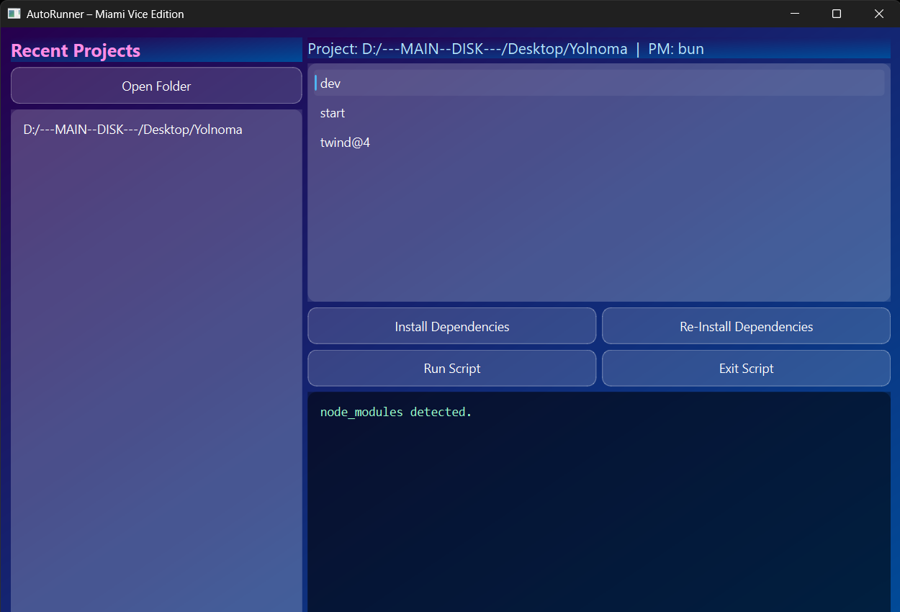

<div align="center">
  
</div>

---

`Auto Runner` is a Python application that automatically runs a specified script whenever changes are detected in a designated directory. It is built using PyQt6 for the graphical user interface and watchdog for monitoring file system events.

## Screenshots


### Terminal Output


### Recent caches


## Installation
### Download
You can download the latest release from the [Releases](https://github.com/jas-kha/AutoRunner-MiamiViceEdition/releases) page.

### Quick Download (v1.0.0)
https://github.com/jas-kha/AutoRunner-MiamiViceEdition/releases/download/download-v1.0.0/auto_runner.exe

=============

## Quick Commands
Run Code:
```
python auto_runner.py
```
Build Executable:
```
python build.py build
```
Clean Build:
```
python build.py clean
```

## Manual commands
```
RUN=python auto_runner.py
BUILD_EXE=pyinstaller --noconsole --onefile auto_runner.py
```

## Requirements
```requirements.txt
PyQt6==6.7.0
watchdog==4.0.1
pyinstaller==6.3.0
```

## Contributing
Feel free to fork the repository and submit pull requests. For major changes, please open an issue first to discuss what you would like to change.

## License
This project is licensed under the MIT License. See the LICENSE file for details.