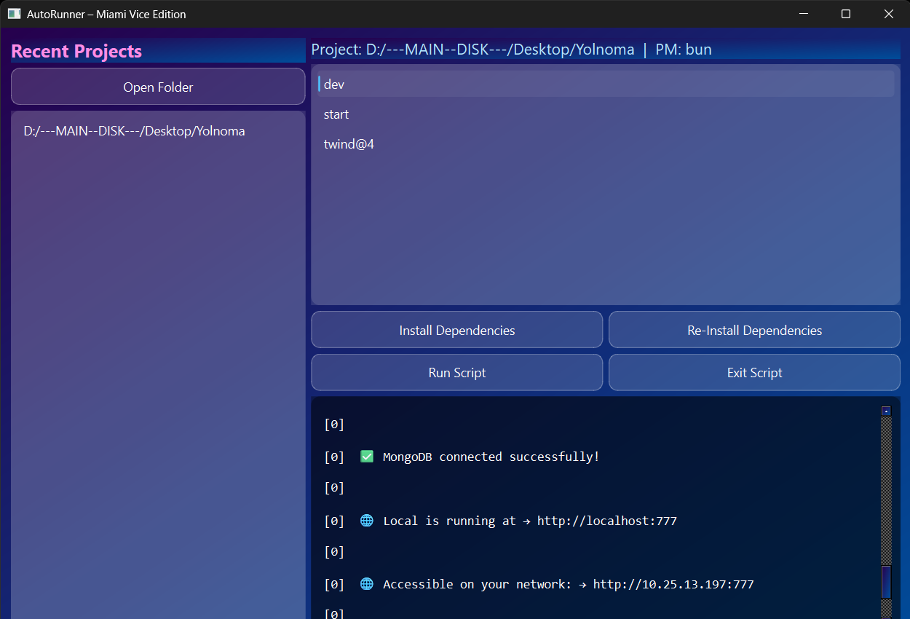

<!-- <div align="center">
  
</div> -->

<div style="background-color: purple; padding: 10px; border-radius: 10px; text-align: center; color: white;">

  ## Auto Runner
  ### Miami Vice Edition

</div>

---

`Auto Runner` is a Python application that automatically runs a specified script whenever changes are detected in a designated directory. It is built using PyQt6 for the graphical user interface and watchdog for monitoring file system events.

## Screenshots


## Installation
### Download
You can download the latest release from the [Releases](https://github.com/jas-kha/AutoRunner-MiamiViceEdition/releases) page.

####  Quick Download Links

| Setup Type | URL | Version |
|-|-|-|
| Installer | [Download AutoRunnerSetup.exe `Recommended`](https://github.com/jas-kha/AutoRunner-MiamiViceEdition/releases/download/download-v1.0.0/AutoRunnerSetup.exe) | v1.0.0 |
| Portable | [Download Portable Version](https://github.com/jas-kha/AutoRunner-MiamiViceEdition/releases/download/download-v1.0.0/auto_runner_portable.exe) | v1.0.0 |

---

## `For Developers`
### Clone the repository

### Quick Commands
Run Code:
```
python main.py || python scripts.py run
```
Build Executable:
```
python scripts.py build
```
Clean Build:
```
python scripts.py clean
```

### Manual commands
```
RUN=python main.py
BUILD_EXE=pyinstaller --noconsole --onefile main.py
```

### Manual Recent Cache Location
```
AppData\Roaming\JK Software\AutoRunner\recent.json
```

### Requirements
```requirements.txt
PyQt6==6.7.0
watchdog==4.0.1
pyinstaller==6.3.0
```

## Contributing
Feel free to fork the repository and submit pull requests. For major changes, please open an issue first to discuss what you would like to change.

## License
This project is licensed under the MIT License. See the LICENSE file for details.

---

# © 2026 JK Software