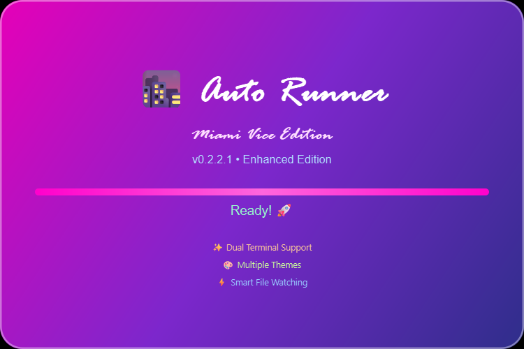
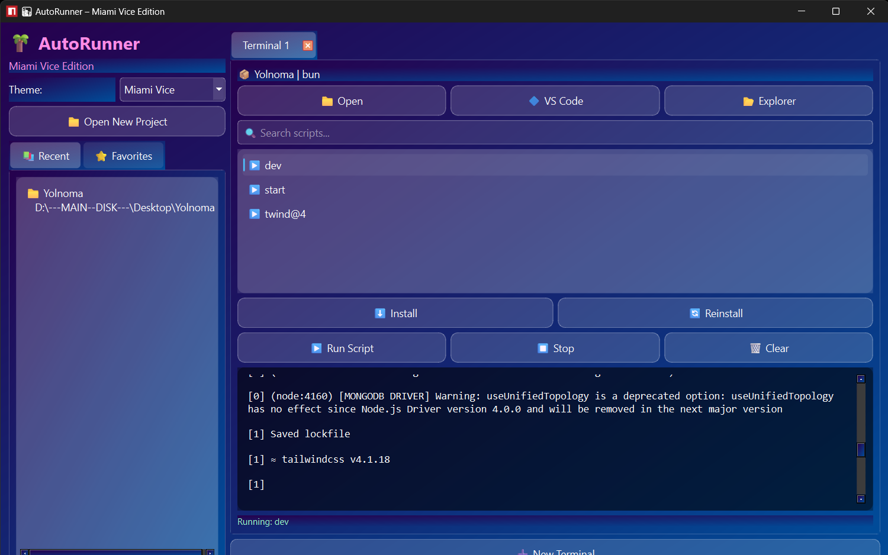

<div align="center">
  
</div>

# 🌴 AutoRunner – Miami Vice Edition

[](https://opensource.org/licenses/MIT)
[](https://www.python.org/)
[](https://pypi.org/project/PyQt6/)

A sleek, powerful Python GUI application for managing and running Node.js projects with automatic file watching and script execution. Inspired by the Miami Vice aesthetic with multiple themes and terminal tabs.

## ✨ Features

- **Multi-Terminal Support**: Run multiple projects simultaneously in separate tabs
- **Auto-Reload**: Automatically detects file changes and runs scripts
- **Package Manager Detection**: Supports npm, yarn, pnpm, and bun
- **Script Management**: Easy selection and execution of npm scripts
- **Theme System**: Multiple themes including Miami Vice, Dark, and Light
- **Project History**: Recent and favorite projects management
- **Dependency Management**: Install, reinstall, and check dependencies
- **File Watching**: Real-time monitoring of project files
- **Drag & Drop**: Load projects by dragging folders
- **Console Output**: Rich console with clickable links and syntax highlighting

## 📸 Screenshots



## 🚀 Installation

### For Users (Pre-built Executables)

Download the latest version from the [Releases](https://github.com/jas-kha/AutoRunner-MiamiViceEdition/releases) page.

#### Latest Versions

| Setup Type | Download | Version |
|------------|----------|---------|
| Installer (Recommended) | [AutoRunnerSetup.exe](https://github.com/jas-kha/AutoRunner-MiamiViceEdition/releases/download/download_v0.2.0.0/AutoRunnerSetup.exe) | v0.2.0.0 |
| Portable | [AutoRunner_portable.exe](https://github.com/jas-kha/AutoRunner-MiamiViceEdition/releases/download/download_v0.2.0.0/AutoRunner_portable.exe) | v0.2.0.0 |

#### Stable Versions

| Setup Type | Download | Version |
|------------|----------|---------|
| Installer | [AutoRunnerSetup.exe](https://github.com/jas-kha/AutoRunner-MiamiViceEdition/releases/download/download-v1.0.0/AutoRunnerSetup.exe) | v1.0.0 |
| Portable | [auto_runner_portable.exe](https://github.com/jas-kha/AutoRunner-MiamiViceEdition/releases/download/download-v1.0.0/auto_runner_portable.exe) | v1.0.0 |

### For Developers

#### Prerequisites
- Python 3.8 or higher
- Node.js and npm (for running Node.js projects)

#### Clone and Setup
```bash
git clone https://github.com/jas-kha/AutoRunner-MiamiViceEdition.git
cd AutoRunner-MiamiViceEdition

# Create virtual environment
python -m venv .venv
.venv\Scripts\activate  # On Windows

# Install dependencies
pip install -r requirements.txt
```

## 📖 Usage

1. **Launch the Application**
   ```bash
   AutoRunner.exe
   ```

2. **Load a Project**
   - Click "📁 Open New Project" and select a folder containing `package.json`
   - Or drag and drop a project folder into the application
   - The app automatically detects your package manager (npm/yarn/pnpm/bun)

3. **Manage Dependencies**
   - Click "Install" to install project dependencies
   - Use "Reinstall" to clean and reinstall `node_modules`

4. **Run Scripts**
   - Select a script from the list (e.g., `▶️ dev`, `▶️ build`)
   - Click "Run Script" or double-click the script
   - Scripts run automatically when files change

5. **Multiple Terminals**
   - Click "➕ New Terminal" to open additional tabs
   - Each tab can run a different project

6. **Themes**
   - Choose from various themes in the left panel
   - Default is "Miami Vice" theme

## 🛠️ Development

### Quick Commands

| Command | Description |
|---------|-------------|
| `python main.py` | Run the application |
| `python scripts.py run` | Alternative run command |
| `python scripts.py build` | Build executable |
| `python scripts.py setup` | Create Installer |
| `python scripts.py clean` | Clean build files |

### Building Executables

```bash
# Build standalone executable
python scripts.py build

# Or manually
pyinstaller --noconsole --onefile main.py
```

### Project Structure

```
AutoRunner/
├── main.py                 # Main application entry point
├── core/                   # Core functionality
│   ├── constants.py        # App constants and file paths
│   ├── fonts.py           # Font loading
│   ├── runner.py          # Script execution thread
│   ├── theme_manager.py   # Theme management
│   ├── utils.py           # Utility functions
│   └── watcher.py         # File watching thread
├── ui/                     # UI components
│   ├── splash.py          # Splash screen
├── assets/                 # Static assets
│   ├── fonts/
│   └── icons/
├── build/                  # Build artifacts
└── scripts.py              # Build and utility scripts
```

For major changes, please open an issue first to discuss the proposed changes.

### Requirements

```
PyQt6==6.7.0          # GUI framework
watchdog==4.0.1       # File system monitoring
pyinstaller==6.3.0    # Executable builder
qtawesome==1.4.0      # Icons
```

### Cache Location

Recent projects are stored in:
```
<!-- Recently Open Folders -->
%APPDATA%\JK Software\AutoRunner\recent.json

<!-- Favorite folders -->
%APPDATA%\JK Software\AutoRunner\favorites.json

<!-- Configurations -->
%APPDATA%\JK Software\AutoRunner\settings.json
```

## 🤝 Contributing

We welcome contributions! Please follow these steps:

1. Fork the repository
2. Create a feature branch: `git checkout -b feature/your-feature`
3. Commit your changes: `git commit -m 'Add some feature'`
4. Push to the branch: `git push origin feature/your-feature`
5. Open a Pull Request

For major changes, please open an issue first to discuss the proposed changes.

## 📄 License

This project is licensed under the MIT License - see the [LICENSE](LICENSE) file for details.

## 🙏 Acknowledgments

- Built with [PyQt6](https://pypi.org/project/PyQt6/)
- Icons by [QtAwesome](https://pypi.org/project/QtAwesome/)
- File watching powered by [watchdog](https://pypi.org/project/watchdog/)

---

<div align="center">
  <p>Made with ❤️ by JK Software</p>
  <p>© 2026 JK Software. All rights reserved.</p>
